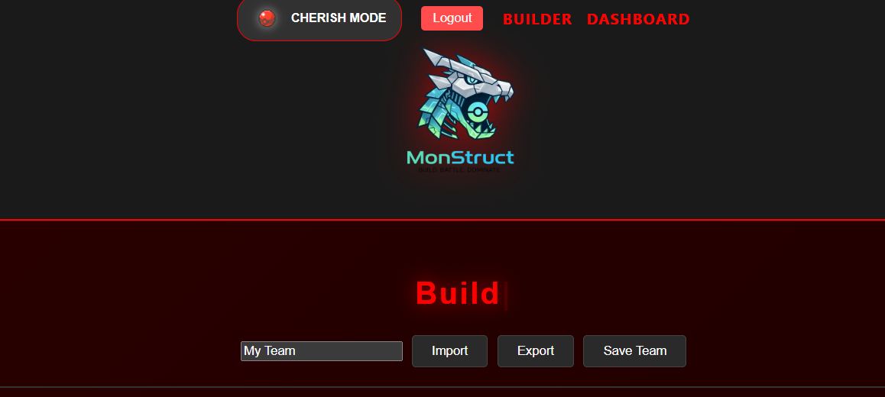
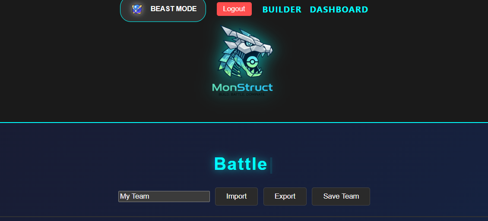

# Monstruct






## Table of Contents

- [Tech Stack](#tech-stack)
- [Key Features](#key-features)
- [Technical Challenges & Successes](#technical-challenges)
- [Installation & Setup](#-installation--setup)

## <a name ='tech-stack'></a>Tech Stack

- **Frontend:** React with Vite (High-performance UI)
- **Language:** TypeScript (Type-safety for complex data structures)
- **Backend:** Node.js / Express
- **API:** GraphQL (User data & mutations) & REST (PokéAPI integration)
- **Database:** MongoDB
- **Assets:** Cloudflare R2 (Optimized animated sprite hosting)

## <a name ='key-features'></a> Key Features

### - Hybrid Data Architecture

Built to handle the complexity of the Pokémon ecosystem, the app utilizes a hybrid approach:

- **REST API:** Leveraged for species-wide data to ensure stability during PokéAPI's GraphQL beta phase.
- **GraphQL:** Powers the user authentication and team persistence layer. Using **Mutations** and **Resolvers**, the app achieves efficient "single-trip" data updates.

### - Showdown Integration

Features a robust `showdownParser.ts` utility that allows users to:

- **Export:** Convert complex TypeScript objects into the "Showdown Text" format.
- **Import:** Utilize string parsing and Regex to map raw text blocks back into the application's state.

### - Real-time Move Data

Hovering over any move provides a dynamic modal showing:

- **Type-Color Badging:** Automatically color-coded based on the move's elemental type.
- **Stat Clarity:** Power (POW), Accuracy (ACC), and PP at a glance.

## <a name ='technical-challenges'></a> Technical Challenges & Successes

- **Challenge:** Data Normalization. Bridging the gap between the rate-limited PokéAPI GraphQL and the standard REST API required building a custom data-fetching layer that maintained type-safety across both sources.
- **Success:** The implementation of **TypeScript Interfaces**. By strictly typing the `PokemonData` and `Move` contracts, the app remains resilient to "undefined" errors, even when handling deep-nested data from the Showdown parser.

## Installation & Setup

1. **Clone the repo:**
   ```bash
   git clone [https://github.com/cgxgb123/monstruct-frontend.git](https://github.com/cgxgb123/monstruct-frontend.git)
   ```
2. **Install Dependencies:**
   ```bash
   npm install
   ```
3. **Environment Configuration:**
   Create a `.env` file with your GraphQL endpoint:
   ```env
   VITE_API_URL=http://localhost:4000/graphql
   ```
4. **Start Development Server:**
   ```bash
   npm run dev
   ```

---

Built by [Christian Blunt](#https://www.linkedin.com/in/christiangblunt/)
